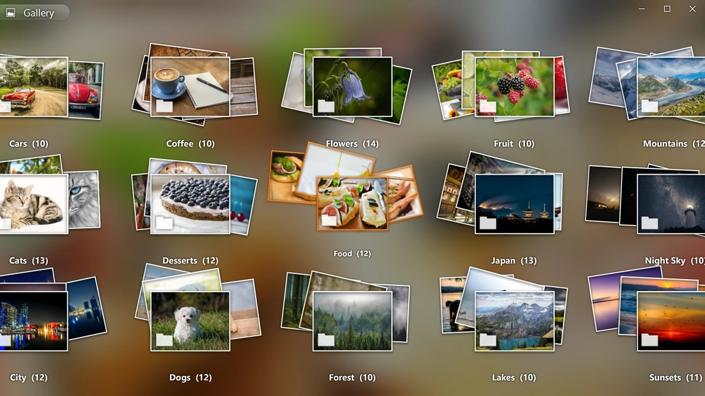
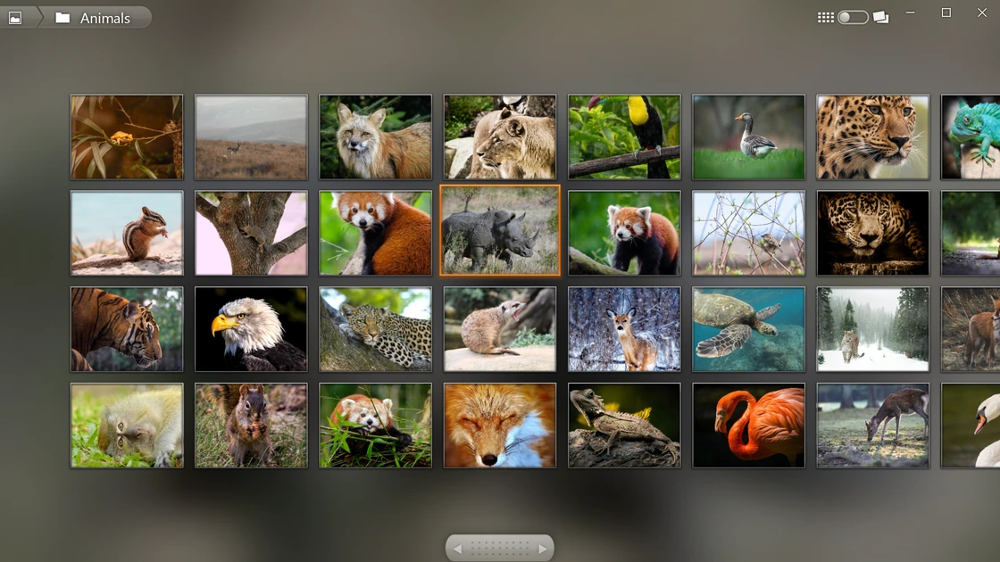
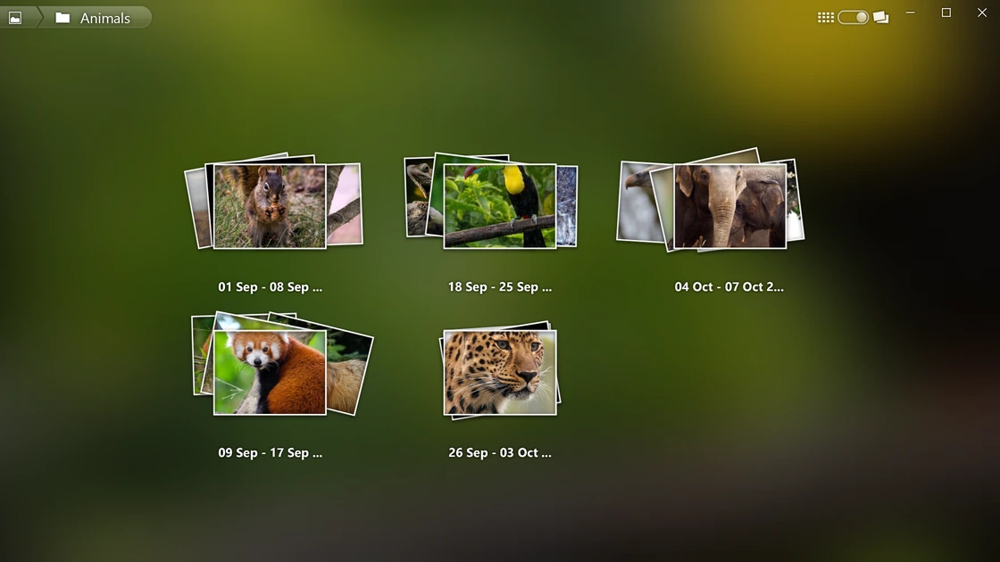
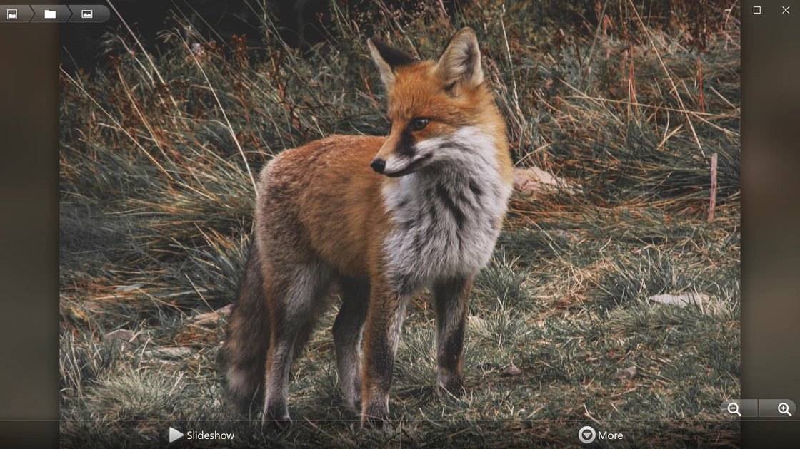
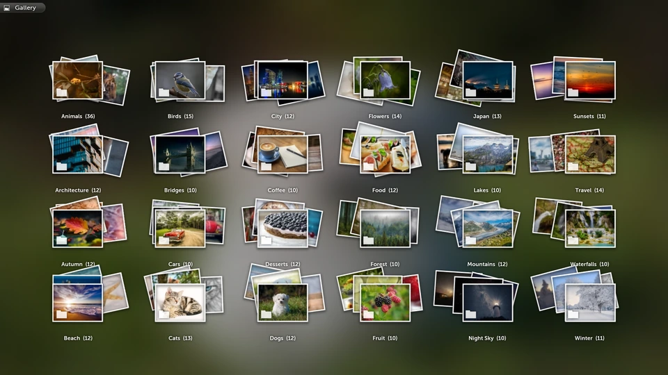
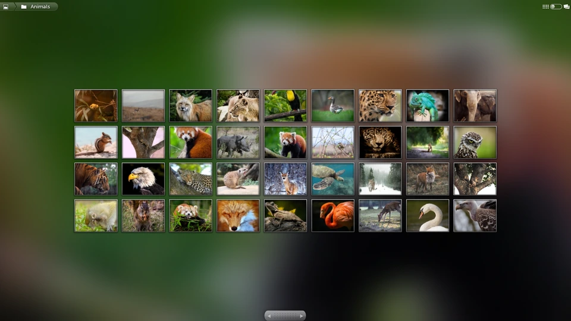
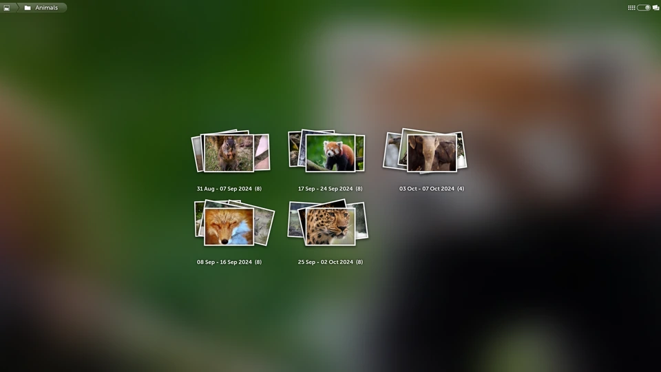
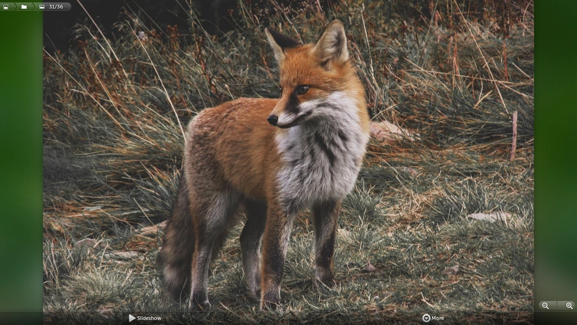

# Gallery3D SDL

A C++17 / SDL3 port of the Cooliris 3D photo wall from Android. Runs on Windows,
Linux, macOS, Android, iOS and LG webOS TVs.

## Features

- Browse photo folders as 3D album stacks
- Scroll and fling the wall, open photos and zoom in
- Read the Windows Pictures library and USB drives on webOS
- Use mouse, keyboard or touch controls

## Screenshots

### Desktop

| | |
|---|---|
|  |  |
|  |  |

### webOS

| | |
|---|---|
|  |  |
|  |  |

## Download

Windows, Android, iOS and webOS builds are available from
[GitHub Actions](https://github.com/mariotaku/Gallery3D/actions/workflows/build.yml).
Select a successful run and download its artifact. The iOS build is unsigned.

For Linux and macOS, see [Building](docs/building.md).

## Documentation

- [Usage, settings and controls](docs/usage.md)
- [Building and platform notes](docs/building.md)
- [Artwork](art/README.md)

## Credits

- Cooliris and the Android Open Source Project, for the original Gallery3D
- Based on AOSP `platform/packages/apps/Gallery3D`, tag `android-2.3.7_r1`.
- Photos in the screenshots are from [Pixabay](https://pixabay.com/), under the
  [Pixabay Content License](https://pixabay.com/service/license-summary/).

Licensed under [Apache 2.0](LICENSE).
