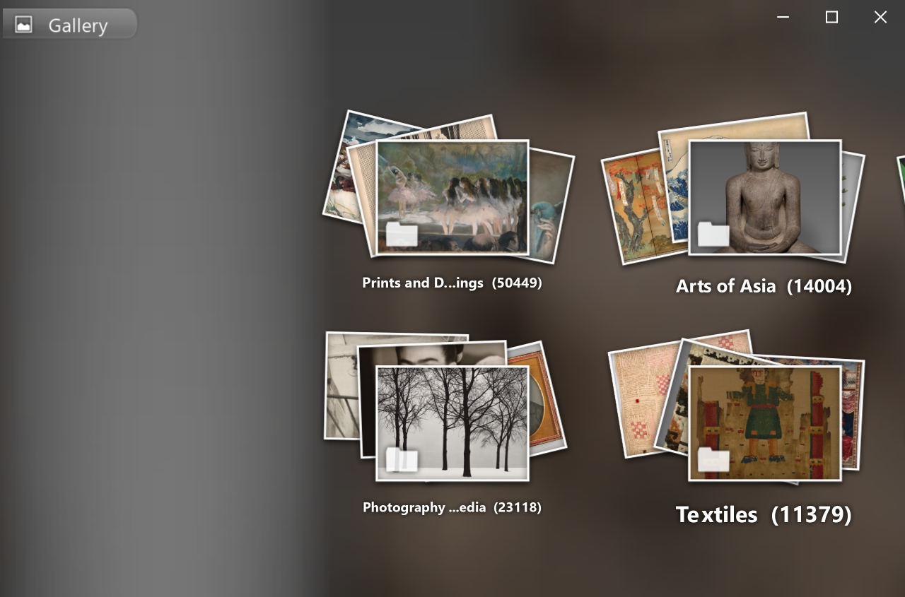
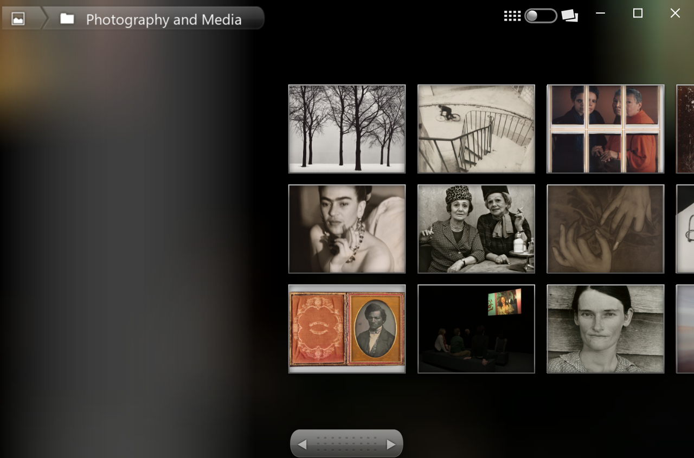

# Gallery3D SDL

A C++ / SDL3 port of the Cooliris "Gallery3D" photo wall from Android, taken from
AOSP `platform/packages/apps/Gallery3D` at tag `android-2.3.7_r1`, the last
Gingerbread release and the final state of this package.

It browses a directory of photos as the original did: one 3D stack per folder,
tap a stack to drop into that album's grid, fling along the wall.



## Why this port is straightforward

The original renderer targets **OpenGL ES 1.1 fixed function** (`GL11`, client
vertex arrays, `glTexEnv`, `OES_draw_texture`). All of that is gone in ES 2.0, so
`RenderView` absorbs it:

| Original | Here |
| --- | --- |
| `glMatrixMode` / `glTranslatef` / `GLU.gluLookAt` | `MatrixStack` + `Mat4` in `RenderView` |
| `glTexEnv` `GL_REPLACE` and `GL_MODULATE` | the `uColor` uniform |
| `glTexEnv` `GL_COMBINE` / `GL_INTERPOLATE` | the two texture mix program |
| `glDrawTexfOES` (`OES_draw_texture`) | an ortho projected quad whose `z` is written straight to depth |
| `glVertexPointer` / `glTexCoordPointer` | vertex attributes 0, 1 and 2 |
| `Bitmap` / `BitmapFactory` / `Canvas` | `Bitmap` on SDL_image |
| `StringTexture` via `android.graphics.Canvas` | `StringTexture` via SDL_ttf |
| `MediaStore` `ContentProvider` | `LocalDataSource`, a directory walk |
| `GLSurfaceView` render thread + `Handler` | the SDL event loop + `std::thread` loaders |

Everything above that line - the wall layout, the camera, the stack jitter, the
frame mesh, the visible range search, the display item animation - is a direct
translation. File names match the Java ones so the two can be read side by side.

## Base version

`android-2.3.7_r1` is byte identical to `android-2.3.6_r1` and to the
`gingerbread` branch head, so it really is the end of the line: Google deleted
the in-tree rewrite before 2.3_r1 with "we are doing all our rewrites in Master
(Honeycomb)", and the package was frozen after that.

The GL pipeline itself - `RenderView`, `GridDrawManager`, `GridQuad`,
`GridCamera`, the wall layout - is unchanged all the way from Froyo. What
Gingerbread did change, and what this port therefore carries, is five fixes,
each marked with a comment where it lands:

- `GridCameraManager::constrainCameraForSlot` centres instead of clamping when
  the viewport is larger than the image, so a zoomed out photo stops drifting
  into a corner.
- `GridInputProcessor::onScale` zooms about the focus point and pans by the
  focus delta, so the pixels under your fingers stay put, and it no longer
  clamps at the end of the gesture.
- `GridLayer::setZoomValue` converges at 10x, so the camera tracks a pinch
  instead of lagging behind it.
- `MediaBucketList::add` matches sets and items by reference instead of by id,
  fixing selection when two of them share an id.
- `MediaFeed::addMediaSet` drops a stale set with the same id before adding,
  so a rescan replaces an album instead of duplicating it.

Gingerbread's remaining changes do not apply here: 85% of that diff is new
locales and mdpi assets, and the rest is the Picasa HTTPS fix, a
`WallpaperManager` API migration and an `isExternalStorageRemovable` string -
all in code this port does not have.

## Build

Needs CMake 3.21+, a C++17 compiler and vcpkg (`VCPKG_ROOT` set).

```sh
cmake --preset default
cmake --build build --config Release
```

SDL3, SDL3_image (png, jpeg, webp, tiff) and SDL3_ttf come from the vcpkg
manifest. Assets are copied next to the binary at build time.

## Test

```sh
ctest --test-dir build -C Release
```

Two kinds of test, neither needing a window.

The first covers arithmetic with no picture attached: EXIF decoding, power of
two padding, cover cropping, density bucket selection and nine patch guides.

The second composes each HUD widget off-screen. The bars and popups draw
themselves into a bitmap before anything reaches GL, so `compose()` gives a test
the same pixels the screen gets. Nothing is compared against a stored image;
the checks are on the properties that have actually gone wrong, like a bar
leaving a column of backdrop showing through between two of its pieces. They
run at a fractional density, because the span arithmetic is exact at 1.0 and
only disagrees with itself away from it.

What is left for the screenshot flags on the binary is the 3D wall, where a
mistake needs a camera and a texture to show up at all.

## Run

```sh
build/Release/gallery3d.exe
gallery3d --help
```

It walks a directory tree and makes one album per folder that holds images,
your Pictures folder unless `library.photos` says otherwise. What to browse and
how it should look are [settings](#settings), not flags. `--help` lists them
from the same table the parser uses, so unlike a list here it cannot quietly go
stale.

Three are worth explaining rather than listing.

`wall.scale` says how much bigger the wall is than the phone it was laid out
for. The original's constants come from a 320x480 handset, so at 1.0 the wall is
a small cluster in the middle of the backdrop. It stretches stacks, spacing,
captions and thumbnail resolution together. The display scale applies on top and
separately, so the wall keeps its apparent size on a HiDPI screen while the
controls stay the size that screen asks for.

`window.safe-area` pretends the window has cutouts, as `left,top,right,bottom`.
The HUD lays itself out inside the safe rect SDL reports, so a control never
lands under a notch or a home indicator, while the wall and the backdrop keep
the whole window. A desktop reports no insets, so this is the only way to
exercise that layout here. It exists because the original had no such concept:
in 2009 a phone screen was a rectangle and all of it was yours.

`library.also` shows a second directory on the same wall, through
`ConcatenatedDataSource`. That is the seam another kind of storage would plug
into: each album remembers which source produced it, and the feed asks that one
for its items and for its deletes and rotations.



| Input | Action |
| --- | --- |
| drag | scroll the wall |
| flick | fling |
| click a stack | open that album |
| click a photo | fullscreen |
| double click | zoom in and out of a fullscreen photo |
| wheel | pinch: spreads a stack, zooms a fullscreen photo |
| arrow keys | move the focus |
| enter / space | open |
| esc / backspace | back, and quit from the top level |

The window keeps its system frame, and the content is extended up under the
caption so the backdrop reaches the top edge. Snapping, the resize borders and
the shadow stay the system's to handle. The caption buttons are drawn by the
app, since a client area that covers them has to. It will not resize below 320
by 320 of the display's own units, which is the smallest the HUD and the wall
both fit in.

The flags that remain drive the app to a state and render a fixed number of
frames, so a screenshot is repeatable without a hand on the mouse:

```sh
gallery3d --screenshot out.png --frames 400
gallery3d --open 3 --select --popup 1 --screenshot out.png --frames 400
gallery3d --window-size 320x320 --screenshot out.png
```

Those describe one run, which is why they are arguments and the settings are
not.

## The fullscreen picture

Zoomed in, the fullscreen view draws the picture as a grid of tiles, after
[subsampling-scale-image-view](https://github.com/davemorrissey/subsampling-scale-image-view).
Only the tiles on screen are fetched, and the grid is rebuilt whenever the zoom
crosses a power of two, so a tile stays close to one texel per pixel and the
memory a picture costs follows the screen rather than the original. The
screennail stays underneath as the bottom layer, so a tile that has not arrived
yet shows the blurry version of itself rather than a hole.

There is no region decoder in the port, because there is nowhere to get one:
SDL_image takes a whole file and gives a whole surface, and the web build's stb
backend is no different. So the cropping belongs to whoever holds the original.
A `DataSource` says whether it can crop, and `ArticDataSource` can, because IIIF
puts the wanted rectangle in the url and the museum's server answers with a
tile. A source whose pictures are files on this disk says no, and the view
loads the whole picture once at a higher resolution instead.

## The backdrop

The wall sits on a blurred, darkened copy of the photo under the cursor,
stitched three times across the screen with a quarter of each copy overlapping
the next, and faded out on its right so the joins disappear.

The blur runs on the cropped photo, about 89 by 44 pixels, before it is scaled
up - so a whole backdrop costs well under a millisecond and at most sixteen are
kept. Two kernels:

```ini
[backdrop]
blur  = gaussian   # the default; box is what the original did
sigma = 6.0
```

A box is one nine tap pass per axis. It is cheap, and on a step between two
colours it gives a straight ramp with a corner at each end. The gaussian
defaults to the same spread - 2.58, which is the root of a nine tap box's
variance - so turning it on changes the shape of the falloff and not the amount
of wash. Raising the sigma is the way to a softer one.

On the web the same two arrive as `?blur=box` and `?sigma=6`, since a phone is
where a heavier blur would be felt and the hardest place to rebuild.

## Settings

Three places, each beating the one before it: the defaults compiled in, an ini
file, the environment. The file holds what you always want, the environment
overrides it for one shell.

Settings have no flag form. A value that could be written in three places, one
of them quietly beating the other two, is a value you have to go looking for.

```ini
# gallery3d.ini
[library]
photos = D:/Pictures
artic  = no

[wall]
scale = 1.5

[backdrop]
blur  = gaussian
sigma = 4.0
```

Looked for as `gallery3d.ini` in the working directory, then in the platform's
own config directory for the app. `--config PATH` or `GALLERY3D_CONFIG` names
one instead, and a named file that cannot be read is an error rather than a
shrug.

One name per setting, written `section.key`. The environment variable follows
from it - `backdrop.sigma` is `GALLERY3D_BACKDROP_SIGMA` - so there is no
second list to keep in step. `--help` prints the lot.

What belongs in a settings file is a setting. The flags that drive a
screenshot - `--open`, `--frames`, `--zoom` - are verbs describing one run, and
they stay on the command line alone.

Startup logs every setting that came from somewhere, with where:

```
Settings from gallery3d.ini
  backdrop.blur = gaussian (environment)
  backdrop.sigma = 4.5 (gallery3d.ini)
```

A key that is not recognised is named with its file and line, rather than
ignored.

A page has neither the file nor a shell, so the web build takes settings from
the address: `?blur=box`, `?sigma=6`, `?scale=1.2`.

## Graphics context

It asks SDL for an **ES 2.0** context and falls back to a desktop GL 2.1
compatibility context if the driver refuses. The only difference is the shader
prelude (`#version 100` plus precision qualifiers, or `#version 120`); the entry
points the port uses exist in both. `src/gles2.h` declares them and loads them
through `SDL_GL_GetProcAddress`, so there is no GL loader dependency.

## What is not ported yet

The 3D grid and the HUD are done: album stacks, drill down, fling, fullscreen,
the path bar, the selection and fullscreen bars with their popup menus, and the
time bar. Timeline clustering is the real thing, delete and rotate work, the
details sheet says what is known about a selection, and a video opens in
whatever the desktop plays it with.

Still missing and wanted: a build on anything other than Windows. That is the
whole list.

Deliberately not ported, and closed rather than pending:

- The crop screen, set as wallpaper, and share. This gallery shows pictures
  rather than edits them, and the share sheet has no desktop counterpart.
- The wallpaper service and the home screen widget, neither of which a desktop
  has anywhere to put.
- Picasa sync, whose service is long gone. The `DataSource` interface it
  implemented is still the seam another storage backend would use.
- Reverse geocoding, which would mean sending someone else's coordinates to a
  third party. `LocationMediaFilter` and the filtering behind it stay unported
  with it. The slot's location button and the filter it opens are here and
  correct, but both are reached only through a place name, so without a
  geocoder neither ever appears.
- `ImageManager` and the content provider plumbing, which is Android specific
  throughout.
- `MovieView`, the video player. It was a separate activity with a `VideoView`,
  never part of the wall: 2.3 had no way to put video in a GL texture, since
  `SurfaceTexture` arrived in the release after this code was frozen. The wall
  showed a still and a play triangle and handed the file to a player, which is
  what this does.
- `GridQuadMesh`, `VirtualFeed`, `PagedFeed` and `ContextMenu`, which nothing
  in the original references either.

## Licence

The original is Apache 2.0, Copyright 2009 The Android Open Source Project; see
`MODULE_LICENSE_APACHE2`. This port keeps that licence.
